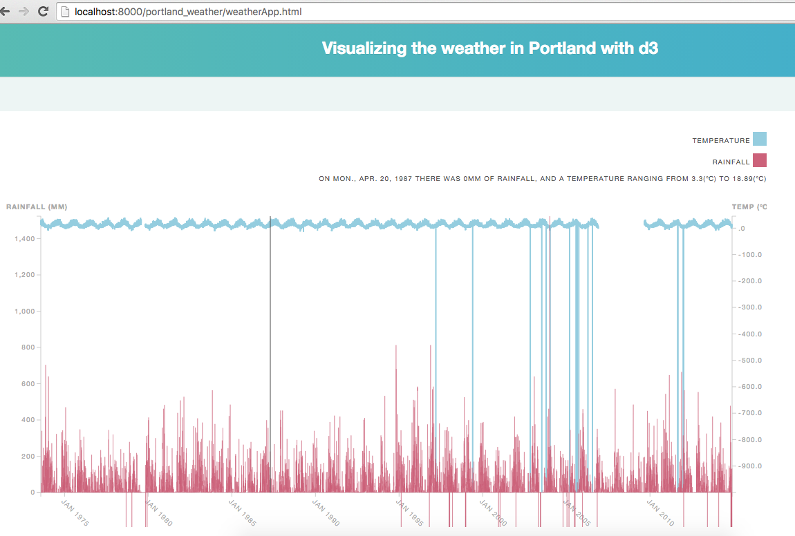

Weather in Portland exploring d3.js
------------------------------------

Functionality
------------
* see the temperature and rainfall between 1973 and 2014
* see exact amount by placing cursor on area which to examine

Technologies used:
------------------
* JavaScript
* d3js
* HTML
* CSS

HOW TO USE
----------
* git clone https://github.com/sara6/weather_portland.git
* cd portland_weather
* open local server i.e. python -m SimpleHTTPServer
* visit http://localhost:8000/
* click through to weatherApp.html where graph is displayed

ACKNOWLEDGMENTS
---------------
* Huston Hedinger d3 workshop
